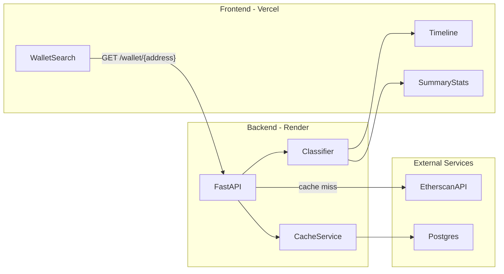
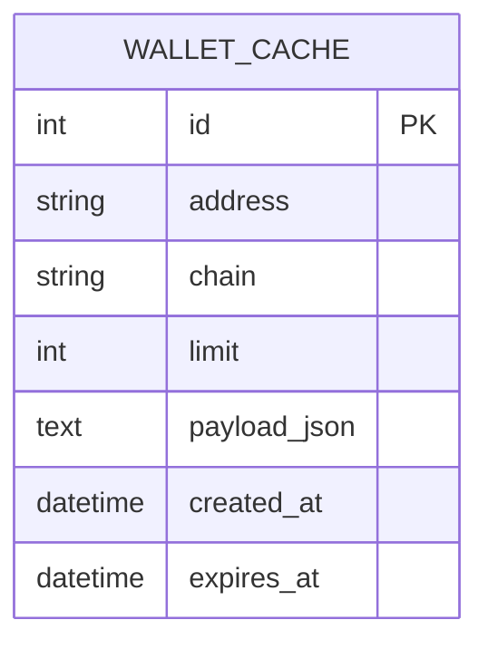

# ChainReader

**On-chain wallet activity, explained.**

ChainReader takes any public Ethereum wallet address, pulls its transaction history from the blockchain, classifies each transaction into a human-readable category, and renders it as a readable timeline instead of a raw list of hashes and hex data.

> MLH Fellowship code sample — TypeScript frontend + Python backend

---

## Table of contents

- [Project overview](#project-overview)
- [Architecture](#architecture)
- [Getting started](#getting-started)
- [Quick demo](#quick-demo)
- [Example](#example)
- [API reference](#api-reference)
- [Classification rules](#classification-rules)
- [Testing](#testing)
- [Deployment](#deployment)
- [Future work](#future-work)
- [Contributing](#contributing)
- [Acknowledgements](#acknowledgements)

---

## Project overview

Blockchain explorers like Etherscan show you transactions — but not what they *mean*. A wall of hashes, hex input data, and contract addresses is hard to parse even for developers, and nearly impossible for non-technical users.

**ChainReader solves this** by adding a classification and labeling layer on top of raw on-chain data:

| Raw explorer view | ChainReader view |
|---|---|
| `0x7a250d56…` + `0x38ed1739…` | **Token swap** via Uniswap |
| `0x` input, `1.5 ETH` value | **ETH sent** to `0xd8dA…6045` |
| `txreceipt_status: 0` | **Failed transaction** |

### What it does (MVP)

1. **Wallet lookup** — enter a public Ethereum address; backend fetches recent transaction history via the Etherscan API
2. **Transaction classification** — rule-based logic labels each tx: transfer in/out, token transfer, swap, contract call, likely NFT mint, failed
3. **Summary stats** — total in/out, transaction count by category, most active counterpart addresses
4. **Timeline UI** — chronological feed with icon, label, amount, counterpart, timestamp, and Etherscan link
5. **Caching** — Postgres cache so repeated lookups of the same address are fast and API rate limits are respected

### What is out of scope (MVP)

- Multi-chain support (Ethereum mainnet only for now)
- ML-based classification (rules are intentional — explainable and testable)
- Wallet connect / write transactions (read-only by design)
- USD price conversion

---

## Architecture



**Request flow:**

1. User submits a wallet address on the frontend
2. `GET /wallet/{address}?limit=50` — address validated (`0x` + 40 hex chars)
3. Postgres cache checked (key: `address + chain + limit`, TTL ~15 min)
4. On cache miss: Etherscan `txlist` + `tokentx` fetched, transactions classified, summary computed, result cached
5. Frontend renders timeline + stats; each card links to `https://etherscan.io/tx/{hash}`

### Stack

| Layer | Technology |
|---|---|
| Backend | Python, FastAPI, httpx, SQLAlchemy (async), Postgres |
| Frontend | React, TypeScript, Vite, TanStack Query |
| Data source | Etherscan API (free tier) |
| Testing | pytest (backend), vitest (frontend) |
| Containers | Docker, docker-compose |
| Deployment | Render (backend), Vercel (frontend) |

### Folder structure

```
ChainReader/
├── backend/
│   ├── app/
│   │   ├── main.py              # FastAPI entrypoint
│   │   ├── config.py            # Environment settings
│   │   ├── routers/wallet.py    # /wallet/{address} endpoints
│   │   ├── services/
│   │   │   ├── etherscan.py     # Etherscan API client
│   │   │   ├── classifier.py    # Rule-based classification
│   │   │   └── wallet.py        # Merge, dedupe, summary
│   │   ├── models/              # Pydantic schemas
│   │   ├── db.py                # SQLAlchemy + Postgres
│   │   └── cache.py             # Cache get/set with TTL
│   └── tests/
├── frontend/
│   └── src/
│       ├── components/          # WalletSearch, Timeline, Stats
│       ├── lib/                 # API client, formatters
│       └── types/
├── docker-compose.yml
└── README.md
```

### Database schema



The cache stores the full classified API response as JSON. Lookups are keyed by `(address, chain, limit)` and expire after `CACHE_TTL_SECONDS`.

### Code structure

The backend follows a layered pattern common in FastAPI projects:

| Layer | Responsibility |
|---|---|
| `routers/` | HTTP endpoints, request validation, error responses |
| `services/` | Business logic — Etherscan fetching, classification, aggregation |
| `models/` | Pydantic schemas shared between layers |
| `db.py` / `cache.py` | Persistence and caching |

The classifier (`services/classifier.py`) is framework-agnostic — it has no FastAPI imports and is fully unit-testable in isolation.

---

## Getting started

### Prerequisites

- Python 3.12+
- Node.js 20+
- Docker (for Postgres)
- [Etherscan API key](https://etherscan.io/apis) (free)

### 1. Clone and configure

```bash
git clone https://github.com/keneijeh760-ship-it/ChainReader.git
cd ChainReader
```

### 2. Start Postgres

```bash
docker compose up -d db
```

### 3. Backend

```bash
cd backend
python -m venv .venv

# Windows
.venv\Scripts\activate

# macOS / Linux
source .venv/bin/activate

pip install -r requirements.txt
cp .env.example .env
# Edit .env and add your ETHERSCAN_API_KEY

uvicorn app.main:app --reload
```

API available at [http://localhost:8000](http://localhost:8000)  
Interactive docs at [http://localhost:8000/docs](http://localhost:8000/docs)

### 4. Frontend

```bash
cd frontend
npm install
cp .env.example .env
npm run dev
```

App available at [http://localhost:5173](http://localhost:5173)

### Environment variables

**Backend** (`backend/.env`):

| Variable | Description |
|---|---|
| `ETHERSCAN_API_KEY` | Your Etherscan API key |
| `DATABASE_URL` | Postgres connection string |
| `CORS_ORIGINS` | Allowed frontend origins |
| `CACHE_TTL_SECONDS` | Cache TTL (default: 900) |

**Frontend** (`frontend/.env`):

| Variable | Description |
|---|---|
| `VITE_API_URL` | Backend URL (default: `http://localhost:8000`) |

> **Security:** Never commit `.env` files or hardcode API keys. All secrets are loaded from environment variables via `backend/.env.example` as a template.

---

## Quick demo

With the backend running locally, try these commands:

**Health check:**

```bash
curl http://localhost:8000/health
```

Expected response:

```json
{"status": "ok"}
```

**Wallet lookup** (requires `ETHERSCAN_API_KEY` in `.env`):

```bash
curl "http://localhost:8000/wallet/0xd8dA6BF26964aF9D7eEd9e03E53415D37aA96045?limit=5"
```

Expected response (truncated):

```json
{
  "address": "0xd8da6bf26964af9d7eed9e03e53415d37aa96045",
  "fetched_at": "2026-08-28T12:00:00Z",
  "cached": false,
  "summary": {
    "total_in_eth": "1.23",
    "total_out_eth": "0.45",
    "by_category": { "transfer_in": 2, "swap": 1 },
    "top_counterparts": [{ "address": "0xabc...", "count": 2 }]
  },
  "transactions": [
    {
      "hash": "0x...",
      "category": "swap",
      "label": "Token swap",
      "counterpart": "0x7a250d56...",
      "amount_eth": null,
      "token_symbol": null,
      "timestamp": "2026-08-28T11:00:00Z",
      "explorer_url": "https://etherscan.io/tx/0x..."
    }
  ]
}
```

---

## Example

Paste Vitalik Buterin's public address:

```
0xd8dA6BF26964aF9D7eEd9e03E53415D37aA96045
```

**What you should see:**

- **Summary cards** — total ETH in/out, transaction counts by category, top counterpart addresses
- **Timeline** — newest transactions first, each with a category icon, human label, amount, counterpart, and relative timestamp
- **Etherscan link** — every card links to the raw transaction on Etherscan for verification

---

## API reference

FastAPI generates interactive docs automatically.

| Endpoint | Description |
|---|---|
| `GET /health` | Service health check → `{"status": "ok"}` |
| `GET /wallet/{address}?limit=50` | Classified wallet activity (cached) |
| `GET /wallet/{address}/raw` | Raw Etherscan payloads (dev/debug) |

**`GET /wallet/{address}` response shape:**

```json
{
  "address": "0xd8da6bf26964af9d7eed9e03e53415d37aa96045",
  "fetched_at": "2026-08-28T12:00:00Z",
  "cached": false,
  "summary": {
    "total_in_eth": "1.23",
    "total_out_eth": "0.45",
    "by_category": {
      "transfer_in": 5,
      "swap": 2,
      "token_transfer": 3
    },
    "top_counterparts": [
      { "address": "0xabc...", "count": 4 }
    ]
  },
  "transactions": [
    {
      "hash": "0x...",
      "category": "swap",
      "label": "Token swap",
      "counterpart": "0x7a250d56...",
      "amount_eth": null,
      "token_symbol": null,
      "timestamp": "2026-08-28T11:00:00Z",
      "explorer_url": "https://etherscan.io/tx/0x..."
    }
  ]
}
```

Full interactive reference: [http://localhost:8000/docs](http://localhost:8000/docs)

---

## Classification rules

Rule-based, fully explainable — no ML. Each label maps to an inspectable condition.

| Pattern | Category | Rule |
|---|---|---|
| `txreceipt_status == 0` or `isError == 1` | `failed` | Etherscan failed flag |
| `to` in known DEX router addresses | `swap` | Uniswap V2/V3, SushiSwap |
| Empty input + `value > 0` | `transfer_in` / `transfer_out` | Direction relative to wallet |
| ERC-20 token transfer row present | `token_transfer` | Token movement via `tokentx` |
| Contract address + non-empty input | `contract_call` | Generic contract interaction |
| Zero-value call + mint function selector | `likely_nft_mint` | Heuristic (mint sig `0x40c10f19`, etc.) |
| Everything else | `unknown` | Fallback |

**Known DEX routers (Ethereum mainnet):**

| DEX | Router address |
|---|---|
| Uniswap V2 | `0x7a250d5630B4cF539739dF2C5dAcb4c659F2488D` |
| Uniswap V3 | `0xE592427A0AEce92De3Edee1F18E0157C05861564` |
| SushiSwap | `0xd9e1cE17f2641f24aE83637ab66a2cca9C378B9F` |

---

## Testing

```bash
# Backend — classifier unit tests + API integration tests
cd backend
pip install -r requirements.txt
pytest

# Frontend — formatting helper tests
cd frontend
npm run test
```

---

## Deployment

| Service | Platform | Config |
|---|---|---|
| Backend + Postgres | [Render](https://render.com) | `render.yaml` |
| Frontend | [Vercel](https://vercel.com) | `frontend/vercel.json` |

**Render env vars:** `ETHERSCAN_API_KEY`, `DATABASE_URL`, `CORS_ORIGINS`  
**Vercel env vars:** `VITE_API_URL` (pointing to your Render backend URL)

```bash
# Local full stack
docker compose up
```

---

## Future work

- **Multi-chain** — Polygon, Arbitrum, Base via chain-specific explorers
- **USD conversion** — historical price data for amount context
- **Pagination** — handle wallets with thousands of transactions
- **ML classification** — only with explainability constraints (SHAP, rule distillation)
- **Wallet connect** — optional authenticated view for owned wallets

---

## Contributing

This project is structured for incremental development. If you want to extend it:

1. **Fork** the repo and create a feature branch (`git checkout -b feat/your-feature`)
2. **Follow the existing structure** — routers for HTTP, services for logic, models for schemas
3. **Add tests** — classifier rules get unit tests in `backend/tests/test_classifier.py`; API endpoints in `test_wallet_endpoint.py`
4. **Use conventional commits** — e.g. `feat(backend): add polygon chain support`
5. **Never commit secrets** — use `.env` locally, document new vars in `.env.example`
6. Open a **pull request** with a clear description of what changed and why

### Areas open for contribution

- Additional DEX router addresses
- New classification rules with corresponding unit tests
- Multi-chain explorer client implementations
- Frontend accessibility improvements

---

## Acknowledgements

- [Etherscan API](https://docs.etherscan.io/) for on-chain transaction data
- [FastAPI](https://fastapi.tiangolo.com/) for the backend framework and auto-generated OpenAPI docs
- [MLH Fellowship](https://fellowship.mlh.io/) for the code sample structure and engineering standards
- Built as a portfolio project demonstrating blockchain data engineering and full-stack development
